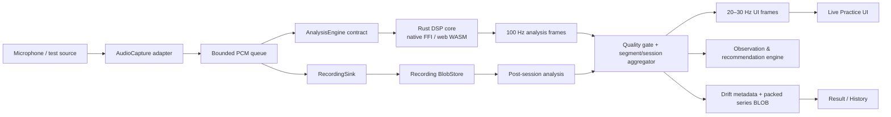

# 练声助手项目蓝图

版本：1.0  
日期：2026-08-03  
状态：规划基线；任何架构变更应先更新本文或补充 ADR。

## 1. 结论先行

本项目采用“Flutter 应用壳 + 可替换采集适配器 + Rust DSP 核心 + 本地优先存储”的架构。最优路径不是一开始自研六个平台的音频驱动，也不是把全部算法写在 Dart，而是先用已经支持六平台 PCM 流的 `record` 验证产品闭环，同时用严格的 Phase 0 指标决定是否需要替换某个平台的采集实现。

MVP 的目标是完成一个可信的小闭环：

1. 选择长音或目标音练习。
2. 实时看到音高、目标偏差、响度、稳定度和信号质量。
3. 录制一个短片段。
4. 得到可解释的描述性总结和下一步练习建议。
5. 下次能与相同练习、相近音区的历史结果比较。

MVP 不把固定频段强弱直接解释成胸声、面罩或声带状态；不把 HNR/CPP 当作“漏气检测器”；不输出医疗诊断或自动疲劳判定。这些限制既是安全要求，也是保证产品可信度的技术要求。

## 2. 对原始指南的关键修订

| 原始设想 | 定稿 |
|---|---|
| Rust + FFI/WASM 直接作为既定事实 | 保留方向，但先做 Windows 原生桥接和 Web WASM 构建/吞吐 spike；失败时允许短期 Dart 基础 DSP 适配器，但接口不变。 |
| 各平台直接考虑 WASAPI/Oboe/CoreAudio | MVP 先使用 `record`；通过测量触发单个平台的联邦插件，不提前承担六套原生实现。 |
| 全链路可以统一采样率 | 采集优先 48 kHz；全带宽频谱分支保留 48 kHz，音高分支抗混叠降到 16 kHz。 |
| FrameFeature 每帧写 SQLite | 禁止逐帧 SQL 行。用 Float32/bitset 列式 BLOB 保存降采样时间序列。 |
| Web 是简单的 Rust WASM 版本 | Flutter Dart Web 没有真正 isolate；区分 Flutter JS/Wasm 渲染与 Rust DSP WASM，并提供单线程 fallback。 |
| HNR、CPP、频段能量可以推断漏气/挤压 | 只能作为多项声学证据；未经过真实人声验证和专业审查前不输出此类标签。 |
| 疲劳风险分数 | MVP 删除。改为主观签到、当次相对变化和谨慎的休息提示。 |
| 桌面 sidecar 补齐高级指标 | 不进入产品运行时。Praat/脚本只作为开发期参考 oracle，避免平台分裂和 GPL 传播风险。 |
| MVP 同时包含七个一级页面 | 收敛为首页、实时练习、结果、历史、设置五个页面；训练计划、对比、专业分析逐步加入。 |

## 3. 产品边界

### 3.1 用户与首个场景

第一目标用户是能够按提示完成 3–30 秒长音、滑音或简单音阶的自学者。首个高质量场景是“目标音长音”：输入和验收最清楚，适合校准音高、稳定度、音量和起音。

自由演唱、老师模式、参考样本 A/B、个体声区模型属于后续版本。它们依赖音频对齐、内容体系或多用户数据，不能挤进 MVP。

### 3.2 MVP 功能

- 麦克风权限、设备选择、有效采集格式与信号质量显示。
- 长音、目标音、滑音三个练习模板；先完整打磨长音。
- 实时 F0、音名/八度、cents 偏差、RMS/Peak、削波、清晰度、基础稳定度。
- 128 个左右的对数频谱显示 bin 和少量描述性频段能量。
- 最长 60 秒的短段录音；原生可后续放宽，Web MVP 保持 60 秒内存上限。
- 结果页：有效帧比例、目标命中率、音高/音量稳定度、起音和信号质量总结。
- 历史列表和同练习趋势。
- 本地保存、自动删除原音频、仅保存指标三种策略中的后两种至少可配置。
- 确定性观察/建议规则；不依赖云端模型。

### 3.3 Beta 功能

- HNR/周期性离线分析、vibrato rate/extent、滑音连续性。
- 经过算法版本控制的 CPP/CPPS 和 Formant/Burg 实验功能。
- 同练习 A/B 对齐、音区热力图、个人基线。
- 训练计划编排和经专业人员审核的内容包。
- macOS、iOS、Linux 的完整手动设备矩阵。

### 3.4 非目标

- 医疗筛查、疾病或声带状态诊断。
- DAW、音频编辑、混音或自动修音。
- 社区、账号、云同步和远程大模型点评。
- 在 MVP 中训练或内置 CREPE 等神经网络模型。
- 为了“全平台”而在首轮同时自研六个平台采集插件。

## 4. 总体架构

### 4.1 层与依赖方向

- `core/domain`：平台无关实体和接口，不能导入 Flutter 插件、Drift 或 FFI。
- `features/*/application`：用例、状态机和 Riverpod provider。
- `features/*/presentation`：页面和控件，只消费 application state。
- `infrastructure/audio`：`record` 和测试信号的 `AudioCapture` 实现。
- `infrastructure/dsp`：Rust bridge 适配器、批次转换、重启和错误恢复。
- `infrastructure/persistence`：Drift repository 与原生/Web BlobStore。
- `rust/`：与 Flutter UI 完全无关的 DSP crate；桥 API 只暴露稳定 DTO。

依赖只能从外向内：presentation → application → domain；infrastructure 实现 domain contract。domain 不反向知道实现。

### 4.2 关键接口

`AudioCapture`：

- `listDevices()`
- `requestPermission()`
- `start(CaptureRequest) -> CaptureSession`
- `CaptureSession.effectiveFormat`
- `CaptureSession.pcmChunks`
- `CaptureSession.health`
- `stop()` / `dispose()`

`AnalysisEngine`：

- `initialize(AnalysisConfig)`
- `pushPcm(PcmBatch) -> AnalysisBatch`
- `finish() -> OfflineInput/FinalFrames`
- `reset()` / `dispose()`

`RecordingSink`：

- `open(RecordingMetadata)`
- `append(PcmChunk)`
- `finalize() -> RecordingLocator`
- `abort()`

`SessionRepository`：只处理结构化记录与 packed series，不处理录音字节。

## 5. 实时音频合同

### 5.1 采集请求与有效格式

默认请求：

| 参数 | 值 | 原因 |
|---|---:|---|
| sample rate | 48,000 Hz | 保留 5 kHz 以上高频与通用设备原生率。 |
| channels | 1 | 人声分析不需要立体声，减少带宽和歧义。 |
| encoding | signed PCM16 LE | 六平台 `record` 流均支持，跨桥简单。 |
| AGC | off | 保留幅度变化；若平台拒绝，写入 quality flag。 |
| echo cancellation | off | 避免改变谐波和起音；使用耳机降低回授。 |
| noise suppression | off | 避免频谱/周期性指标被处理器改变。 |
| Web stream buffer | 512 起测，1024 fallback | 分别约 10.7 ms 与 21.3 ms；由 Phase 0 测量决定。 |

请求不是事实。每次会话必须记录有效 sample rate、channels、processing flags、device ID/label（经隐私处理）和 chunk cadence。

### 5.2 `PcmChunk`

每个 chunk 至少包含：

- `sequenceNumber`
- `firstSampleIndex`
- `sampleRate`
- `channels`
- `format`
- `bytes`
- `captureMonotonicTime`（仅诊断延迟，不用于特征时间轴）

分析时间统一由 `firstSampleIndex / sampleRate` 推导。chunk 到达时间会受平台 channel、线程调度和浏览器消息影响，不能作为曲线横轴。

### 5.3 背压和失败语义

- fan-out 后使用独立的分析队列和写盘队列，均以音频时长计量，初始容量 250 ms；两边只读共享不可变 chunk，不修改底层字节。
- 采集回调只做格式检查、序号分配和入队，不等待 UI/DB/文件分析。
- 分析队列满时丢弃最旧未分析 chunk，继续录音，并累计 `droppedSamples`；不能无限堆积。
- 写盘队列不能静默丢 chunk。若持续写不动，终止本次录音并保留可恢复的临时文件；否则录音与分析时间轴会不一致。
- 任意序号缺口生成 `discontinuity` quality flag，稳定度/HNR 等跨缺口计算作废。
- 写盘失败不应卡住实时反馈；停止录制并向用户报告可恢复错误。
- DSP worker 崩溃时停止解释性反馈，保留录音，允许会话结束后重算。

## 6. DSP 路径

### 6.1 预处理

1. PCM16 转 `f32 [-1, 1)`。
2. 检测 NaN/格式错误、削波比例、DC offset、RMS 和静音。
3. 轻量 DC blocker（截止约 20 Hz），不要用会削弱低男声 F0 的高截止滤波器。
4. 不进行响度归一化或 AGC；离线显示可以使用归一化副本，但指标使用原幅度。

### 6.2 双分支设计

全带宽分支：

- 保持有效采样率，目标 48 kHz。
- 周期 Hann 窗，FFT 2048，hop 480（10 ms）。若输入为 44.1 kHz，则 hop 441。
- 使用 `realfft`/`rustfft`，复用 plan 和缓冲区，不在实时循环分配。
- 输出 power dBFS、频谱质心/斜率候选、频带功率和 128 个对数 UI bins。
- 瀑布图只保留最近 8–12 秒环形纹理，不保存全会话频谱。

音高分支：

- 用带抗混叠的 resampler 降到 16 kHz。48→16 kHz 精确 3:1 路径优先比较低群延迟 polyphase FIR decimator；44.1 kHz 等非整数路径使用 `rubato`。Phase 0 以 alias rejection、群延迟和 CPU 决定，不做简单抽点。
- 1024 样本窗口（64 ms），160 样本 hop（10 ms）；低音模式可用 2048 样本并明确增加延迟。
- F0 搜索范围默认 60–1200 Hz，由用户音区/练习收紧。
- MPM 作为首个默认候选，因为它面向单音音乐并输出 clarity；YIN 实现保留为对照和 fallback。
- 初期可以使用 `pitch-detection 0.3.0` behind adapter 完成 spike，但因其已多年未发布，不能未经基准直接锁为长期核心；必要时在本仓库实现/维护算法。
- 采用抛物线插值和小型连续性平滑器；必须允许快速滑音，不用大窗口中值滤波抹平变化。
- 未发声状态由能量、clarity、连续性共同决定，不只用单阈值。

### 6.3 实时输出

内部 `AnalysisFrame` 保持 100 Hz：

- `sampleIndex`
- `f0Hz?`
- `pitchClarity`
- `voicedProbability/voiced`
- `rmsDbfs`、`peakDbfs`
- `pitchCents?`（连续 MIDI cents；音名在 Dart 侧生成）
- `bandPowersDb`
- `spectrumBinsDb`（仅 UI 需要的降维 bins）
- `qualityFlags`
- `algorithmVersion`

UI 适配器以 20–30 Hz 发送 `UiAnalysisFrame`。摘要聚合器仍使用 100 Hz 帧，避免 UI 降采样损害统计。

### 6.4 MVP 指标

允许进入 MVP 的指标：

- 目标音偏差：对有效 voiced frame 的 cents 分布。
- 命中率：落在可配置容差内的有效时长比例。
- 音高稳定度：稳态区间内去趋势 cents 的 robust spread（优先 MAD/IQR，不只标准差）。
- 音量稳定度：稳态区间内 RMS dBFS 的 robust spread 和线性漂移。
- 起音时间：能量越阈到稳定 voiced 的时间；只做描述。
- clipping、输入过低、处理器未关闭、丢样、有效帧不足等质量指标。
- 频段能量：以 dB/相对能量显示，文案保持物理描述。

### 6.5 Phase 6 Beta 后续离线指标

HNR、Formant、CPP/CPPS、Jitter/Shimmer 均不属于 Phase 2 DSP MVP；它们只能在
Phase 6 以独立 feature flag、版本化算法和参考验证逐项引入。

HNR：

- 只在足够长、连续、稳态 voiced segment 上计算。
- 采用文档化的自相关/互相关算法和 pitch floor；保存算法参数。
- HNR 对元音、环境和设备敏感，只能同任务/同设备趋势比较，不映射为单一“漏气”标签。

Vibrato：

- 对连续 F0 cents 曲线去慢趋势。
- 在 4–9 Hz 候选范围估计调制主峰、extent 和周期一致性。
- 要求最少 2 秒有效段，并区分刻意滑音与周期调制。

Formant：

- 只对元音稳态段启用 Burg LPC；预加重、窗长、formant ceiling、阶数全部版本化。
- 必须提供轨迹连续性和置信度；不把某一帧 F1/F2 当作稳定结果。
- 不同声部/元音使用不同 ceiling，先通过合成滤波器和参考工具验证。

CPP/CPPS：

- 只在 Phase 6 Beta 逐项验证后实现，并明确遵循的算法版本；不同实现数值范围不可混用。
- 任务类型（持续元音/连续语音）、响度、采集设备和环境必须进入比较条件。
- 不引入来自临床研究的固定疾病阈值。

Jitter/Shimmer：

- 不进入 MVP。只有在周期定位可靠、无断点、无 AGC、任务一致时才计算。
- 即使计算，也作为研究/专业模式描述值；消费级设备不能承诺临床等价。

CREPE/神经 F0：

- 论文表明其在噪声下有优势，但模型体积、推理后端、移动/Web 分发和许可证增加复杂度。
- 只有传统 DSP 在真实人声 benchmark 达不到目标时才建立 `NeuralPitchEstimator` spike，不替换接口。

## 7. Rust 与 Flutter 边界

### 7.1 为什么保留 Rust

- 同一算法可覆盖 x64、ARM64 和 WebAssembly。
- FFT、重采样和离线分析可复用内存并在原生工作线程运行。
- RustFFT 已提供 x86 AVX/SSE、ARM Neon 和可选 WASM SIMD。
- 算法可以独立 `cargo test`/`cargo bench`，不依赖 Flutter 设备。

### 7.2 桥 API 形状

不要每个 sample 或每个指标跨 FFI。Dart 将 10–40 ms 的 PCM 批次交给持久 `RealtimeAnalyzer`；Rust 返回 1 个批量 DTO。对象生命周期：

1. `createRealtimeAnalyzer(config)`
2. 多次 `pushPcm(batch)`
3. `finishRealtimeAnalyzer()`
4. `dispose()`

原生调用运行在 Rust 线程或长寿命 worker，不阻塞 Flutter main isolate。若 Dart 侧需要 isolate 传输，用 `TransferableTypedData`，但先测量 FRB 自身 typed-data 编码，避免双重复制。

### 7.3 Web 策略

必须区分两类 Wasm：

- Flutter Web 默认先采用 JS 构建，覆盖更广浏览器。
- Rust DSP 单独编译为 Wasm，由 FRB web glue/worker 调用。
- Flutter `--wasm`/skwasm 作为后续性能构建，不是 MVP 唯一发布物。

首版 Rust WASM 使用单线程，不要求 SharedArrayBuffer。多线程/SIMD 是可选增强，并以浏览器 feature detection 决定；Safari 的 worker 限制和 COOP/COEP 部署头不能被忽略。

Web PCM 由 `record_web` 的 AudioWorklet 采集。当前源码会按 `streamBufferSize` 聚合工作量并把 Int16Array 发回 Dart；配置 512/1024 均需实测。避免让它在浏览器内做不必要的低质量重采样：请求并接受 AudioContext 的有效采样率，再在 Rust 内做受控分支重采样。

### 7.4 构建选择

首版使用 `flutter_rust_bridge 2.12.x` 稳定线和默认 Cargokit 集成。Native Assets backend 在调研时仍依赖 2.13 beta，不作为默认。`rust-toolchain.toml` 固定到 1.97.1 或实施时确认的安全补丁版本，`Cargo.lock` 提交。

## 8. 平台采集策略

| 平台 | MVP 适配器 | 当前风险 | 替换触发条件 |
|---|---|---|---|
| Windows | `record_windows` / Media Foundation | chunk 尺寸和端到端延迟由实现/驱动决定；处理开关支持较少。 | P95 延迟、丢帧、格式稳定性或设备切换不达门槛时，开发 WASAPI 联邦实现。 |
| Android | `record_android` / AudioRecord | Android SDK 当前未安装；厂商音效、Bluetooth 路由、legacy recorder 差异。 | 原生麦克风延迟/处理器不可控时，评估 Oboe/AAudio 插件。 |
| Web | `record_web` / AudioWorklet | 浏览器权限、有效 sample rate、单线程 DSP、后台 tab 限频。 | 主流目标浏览器 chunk cadence/CPU 不达标时，自建更紧密的 Worklet bridge。 |
| iOS/macOS | `record_darwin` / AVFoundation | 音频 session、耳机/蓝牙路由、macOS entitlement。 | 实测不达标时扩展 AVAudioEngine 插件。 |
| Linux | `record_linux` | 依赖 `parecord`、`pactl`、`ffmpeg`，PipeWire 环境差异。 | Beta 发布前若部署成本过高，开发 PipeWire/CPAL adapter。 |

每个平台都必须测试：权限拒绝/撤回、无设备、设备拔插、采样率变化、蓝牙、睡眠/切后台、暂停恢复、来电或系统独占、应用崩溃后的临时文件恢复。

## 9. 数据与存储

### 9.1 数据原则

- 录音与结构化记录分离。
- 每次分析都有算法版本、配置 hash、输入录音 hash 和状态。
- 原始测量值与用户文案分离；修改文案不重跑 DSP。
- 历史比较只比较兼容的算法版本、练习类型、音区和采集质量。
- 可重新分析旧录音，但不静默覆盖旧结果。

### 9.2 Drift 表

`profiles`：本地配置和可选音区偏好，不要求账号。  
`practice_templates`：练习 ID、版本、步骤、目标、内容 review 状态。  
`practice_sessions`：开始/结束、模板版本、目标、主观签到、状态。  
`recordings`：Blob locator、格式、时长、sha256、保留策略、删除状态。  
`analysis_runs`：core 版本、config hash、输入 hash、开始/结束、状态、错误。  
`feature_series`：时间步、样本起点、列式 BLOB、编码版本、frame count。  
`segment_summaries`：段边界、任务类型、统计值、quality flags。  
`observations`：规则 ID/版本、证据 JSON、置信度、文案 key、状态。  
`recommendations`：exercise ID、原因、优先级、用户反馈。  
`calibrations`：设备指纹（不含敏感硬件标识）、环境统计和有效设置。  
`app_settings`：隐私、保留、显示和无障碍设置。

### 9.3 时间序列 BLOB

`feature_series` 以列保存 little-endian typed arrays：

- `sample_index_delta_u32`
- `f0_hz_f32`（unvoiced 为 NaN 或配合 voiced bitset，二选一并固定）
- `clarity_f32`
- `rms_dbfs_f32`
- `peak_dbfs_f32`
- `pitch_cents_f32`
- `band_power_f32[]`
- `quality_flags_u16`
- `voiced_bitset`

历史存储默认降至 20 Hz。一个 20 分钟会话只有 24,000 帧；数个 Float32 列通常低于 1 MB，远小于 120,000 行 SQL 带来的索引和对象开销。编码头包含 magic、endianness、schema version、frame count 和校验和。

### 9.4 录音 BlobStore

原生：PCM 流先写临时 raw/WAV，结束时补 header、fsync 并原子改名；数据库事务最后提交 locator。  
Web MVP：流在内存中 tee，限制 60 秒（48 kHz mono PCM16 约 5.76 MB），结束后编码 WAV 并存 IndexedDB/OPFS。  
Web Beta：实现增量 OPFS writer，解除短录音限制。

删除顺序可恢复：先标记 pending delete → 删除 blob → 提交 tombstone。应用启动时清理孤儿临时文件并核对数据库引用。

## 10. 观察与建议引擎

### 10.1 数据结构

每条 `Observation` 包含：

- `ruleId`、`ruleVersion`
- `scope`（frame/segment/session/trend）
- `labelKey` 和参数，不在规则里硬编码中文
- `evidence[]`（指标、数值、比较基准）
- `confidence`
- `qualityFlags`
- `basis`（绝对技术门槛、个人基线、同任务历史）
- `recommendationIds[]`
- `suppressedReason?`

规则先经过质量 gate，再经过任务 gate，最后才解释：例如只在“目标音长音 + 稳态段 + 有效帧充分 + 无削波”条件下谈稳定度。

### 10.2 MVP 规则

可直接实现：

- 输入过低、过高、削波或处理器未关闭。
- 目标音持续偏高/偏低。
- 稳态音高波动较大。
- 后半段音高或响度持续下滑。
- 起音后较久才形成稳定音高。
- 有效 voiced 时长不足，无法总结。

暂不实现为结论：

- HNR 低 → 漏气/闭合不足。
- 高频高 → 挤压；低频低 → 提喉。
- 2.5–3.5 kHz 高 → 面罩正确。
- 单次声学变化 → 疲劳/过载。

这些只能作为研究假设，经有标签真实数据、专业评审和误报分析后进入实验规则。

### 10.3 个人基线

至少 5 次同模板、同音区、信号质量合格的会话后才生成基线。用中位数和 MAD/IQR，避免被一次异常值影响。算法版本或设备处理设置变化时分开建基线。

## 11. UI 与可视化

### 11.1 MVP 页面

`Home`：上次结果、今日主观签到、快速开始、历史入口。  
`Live Practice`：目标、当前 note/cents、pitch curve、RMS、quality chip、开始/暂停/结束。频谱置于专业展开区。  
`Session Result`：有效性、目标命中、稳定度、时间轴、观察、建议和保存策略。  
`History`：会话列表、同任务趋势、录音保留状态。  
`Settings`：麦克风、测试输入、处理开关实际值、隐私/存储、显示模式、免责声明。

### 11.2 绘图策略

- 实时 pitch、spectrum、band bars 用 `CustomPainter` 和 `Listenable repaint`，绕开 build/layout。
- 每个图位于 `RepaintBoundary`，固定 ring buffer，不创建无限 point list。
- Spectrogram 使用固定尺寸 RGBA 环形缓冲，10–15 Hz 上传/重绘；禁止每帧生成数万个 Widget。
- 统计图先用 CustomPainter 完成简单折线；若引入图表包，必须单独做性能和无障碍 spike。
- UI 以 20–30 Hz 更新，文本 note 可做 10–15 Hz 稳定化，避免抖动。
- 简洁模式只展示目标偏差、稳定度、音量/信号质量和一句建议；专业模式展示物理指标，不显示未经验证的声学诊断。

### 11.3 可访问性

- 信息不能只靠颜色；偏高/偏低、质量问题都提供文本/图标。
- 屏幕阅读器不朗读每一帧，只在稳定状态变化时节流播报。
- 支持缩放字体、减少动画和高对比主题。
- 开始/停止录音必须有清晰视觉、声音或触觉状态。

## 12. 性能与质量门槛

Phase 0/后续性能目标先作为 gate，实测后允许以 ADR 调整：

| 指标 | 原生目标 | Web 目标 |
|---|---:|---:|
| 稳定音出现到 UI 有效 F0，P50 | ≤120 ms | ≤180 ms |
| 同上 P95 | ≤180 ms | ≤280 ms |
| 10 分钟 dropped samples | <0.1% | <0.5% |
| 60 Hz UI build+raster P95 | <16 ms | <16 ms |
| 连续运行 | 30 分钟无增长性内存泄漏 | 10 分钟无增长性内存泄漏 |

DSP 合成基准初值：

- 80–1000 Hz 纯音：中位绝对误差 <1 cent。
- 含 2–8 次谐波、20 dB SNR：P95 <5 cents，octave error <0.5%。
- 60–1200 Hz 滑音：有效区 P95 <10 cents，不能被平滑器阶梯化。
- 静音/低能量噪声：voiced false positive <1%。
- 已知 5.5 Hz/50 cent vibrato：Beta 检测 rate 误差 <0.2 Hz、extent 误差 <10 cents。

真实人声 gate 必须在经许可的数据或同意采集样本上完成，并按低/中/高音区、元音、设备和环境分层报告；合成结果不能替代它。

## 13. 测试结构

- Rust unit：窗函数、FFT normalization、音名换算以外的 DSP 数学、ring buffer、缺口处理。
- Rust property：任意 chunk 切分产生同样结果；无 panic/NaN 扩散；序号单调。
- Rust golden：确定生成的纯音、谐波、噪声、滑音、vibrato、削波。
- Dart unit：状态机、packed BLOB codec、规则 gate、baseline、删除事务。
- Widget：权限/错误/无数据/低质量/简洁与专业模式。
- Integration：fake capture 完整闭环；真实设备测试单列，不能在 CI 假装通过。
- Performance：FRB batch 大小、内存复制、UI repaint、30 分钟 soak。
- Reference oracle：开发脚本可调用 Praat 比较 HNR/Formant/CPPS，但不链接或分发到应用。

详细阶段和命令见实施手册。

## 14. 隐私、健康与内容治理

- 默认本地处理，无网络依赖。
- 首次录音前说明：录音用途、保存位置、删除策略和应用非医疗性质。
- 用户可选择“保存录音”“分析后删音频保留指标”“结束即删除全部”。
- 日志不写 PCM、录音路径全文、设备硬件唯一标识或用户备注。
- 崩溃报告默认不附录音或详细音频特征。
- 用户报告疼痛、持续沙哑等主观症状时，只建议停止高强度练习并咨询合格专业人员，不由声学算法确认病因。
- 练习文案存为版本化内容，包含作者/审校者/日期/适用范围/禁忌提示/review status。

## 15. 依赖基线（调研快照）

这些是 2026-08-03 的起点，不是允许后续 Agent盲目升级的清单：

| 用途 | 候选 |
|---|---|
| Flutter | stable 3.44.7 / Dart 3.12.2（本机已有） |
| 状态 | `flutter_riverpod 3.4.x`，首期可不用 provider codegen |
| 路由 | `go_router 17.3.x` |
| 采集 | `record 7.1.x` |
| 数据库 | `drift 2.34.x` + `drift_dev`，Web `WasmDatabase` |
| Rust bridge | `flutter_rust_bridge 2.12.x` stable + Cargokit |
| FFT | `realfft 3.5.x` / `rustfft 6.4.x` |
| 重采样 | `rubato 4.x` |
| Pitch spike | `pitch-detection 0.3.0` behind adapter |
| Rust 错误/序列化 | `thiserror`、`serde`，只在确有需要时加入 |

每个依赖需核对 license、维护活跃度、六平台构建、WASM 行为和 transitive size；执行后提交 Dart/Rust lockfile。

## 16. 架构决策与替换点

| 决策 | 当前选择 | 明确替换点 |
|---|---|---|
| Capture | `record` adapter | `AudioCapture` contract / federated plugin |
| DSP | Rust | `AnalysisEngine` contract，可挂 Dart test implementation |
| Pitch | MPM candidate | `PitchEstimator` trait，YIN/Neural 实现 |
| Storage | Drift + BlobStore | repository/BlobStore contract |
| Rules | Dart deterministic | `ObservationEngine`，可换版本化规则包 |
| Charts | CustomPainter | `LiveChartController`；统计图可换包 |
| Web build | Flutter JS + Rust WASM | Flutter `--wasm` 性能构建 |
| Advanced reference | Praat dev oracle | 仅 tool 目录，不进入 runtime |

## 17. MVP 发布定义

只有同时满足以下条件才称为 MVP：

1. Windows、Android、Web 上都能完成长音闭环；未测试的平台明确标为未支持，而非默认打勾。
2. 真实设备格式、延迟、丢帧、内存数据有记录。
3. Pitch 合成与许可人声 benchmark 达到批准门槛。
4. 录音/指标保存与删除策略经过失败恢复测试。
5. 没有逐帧 SQL、无限内存 ring、UI isolate DSP 或生产 Python sidecar。
6. 所有解释性输出经过质量 gate，低质量输入不会生成强结论。
7. `flutter analyze/test`、`cargo fmt/clippy/test`、目标平台构建通过。
8. 隐私说明、非医疗免责声明、第三方许可证清单齐全。

实现顺序和每个 gate 的操作步骤见 `IMPLEMENTATION_PLAYBOOK.md`。
